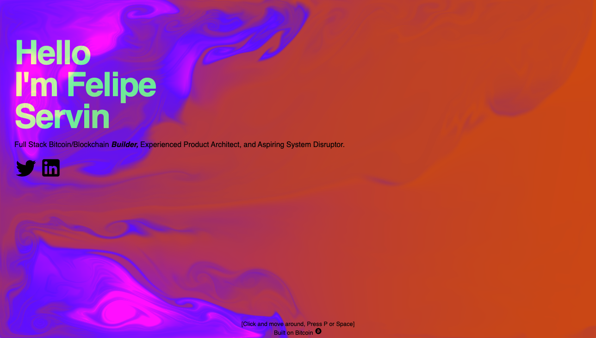

# Website utilizing recursive inscriptions and WebGL with Fluid Simulation

Here is a template you can use to inscribe your own single-page HTML website.

This can be used as a landing page, digital business card, quick bio, or art!

Give a follow [Fservin.btc](https://twitter.com/fservin) and [RT if you like the experiment](https://twitter.com/fservin/status/1669056738732183552?s=20) and show me on Twitter if you inscribe your own!

## Quick instructions:
1. Edit `template.html` and customize it with your own information.
2. Use a minify service like [Code Beautify](https://codebeautify.org/minify-html) to remove comments and extra white space, resulting in the smallest file size possible!
3. Inscribe `template.html` using an inscription service such as [Ordinals Bot](https://ordinalsbot.com/) or [Forever in Bitcoin](https://foreverinbitcoin.com/).
4. You are done! Easy


## Additional notes on how I made this:
### > `original-files/Index.html` was used for internal testing and building the site. It references files cached at [Ord.io](https://ord.io/).

After ensuring everything was working on that level, I first inscribed the JS WebGL file and noted its Inscription ID.

Next, I created a new document and replaced the static files with the `/content/[INSCRIPTION-ID]` format.

I also minified the HTML file, which isn't mandatory, but it reduces unnecessary whitespace and makes it even cheaper to inscribe.

### > The actual HTML file I initially inscribed is at `original-files/felipe-servin.html`.

Lastly, big shout-outs to the fantastic folks at Ord.io [Zach](https://twitter.com/zachmeyer_) and [Leonidas](https://twitter.com/LeonidasNFT) for their awesome work! Special thanks to Casey ([@rodarmor](https://twitter.com/rodarmor)) and the Ordinals contributors for bringing this new capability to Bitcoin.

And let's not forget the legendary Pavel Dobryakov, who wrote the beautiful JS file for fluids! Check out his work on [GitHub](https://github.com/PavelDoGreat/WebGL-Fluid-Simulation).

### > To use this JS file, you can reference [Ord.io/11846310](https://www.ord.io/11846310) like this:

```html
<script src="/content/3af8500b444c7f589fca666fe317e1f95c7226d49dc23f8a4b86093f01f3e7adi0"></script>
```

**Note:** Version 2 is on the horizon, offering controls and the ability to print your art. Stay tuned! 😉
